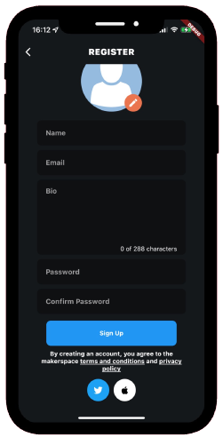

# makerspace

A social application where makers and builders can share there small wins and update on how their getting on with their projects.

 

The stack for this project is Flutter and firebase.

Firebase functions are used to send push notifications to users and to remove the streak using a cron job, this runs every hours to reset all expired streaks to 0.

## Key Features
 - firebase authentication - email & password, twitter, apple
 - firestore - create tasks, mark them as done to post, view a feed of all members updates
 - create profiles and add links to your twitter, website and indie hackers page
 - report content you find offensive
 - streaks - create streaks by completing a task everyday, view these in the leaderboard.

## Get started
 - clone the repo
 - create a new firebase project and follow the guides to insert the plist and json file (https://firebase.google.com/docs/flutter/setup?platform=ios)
 - cd into the functions folder and follow the documentation to deploy the functions (https://firebase.google.com/docs/functions/get-started)
 - follow the flutterfire documentation to add push notifications to the app (https://firebase.flutter.dev/docs/messaging/notifications/)
